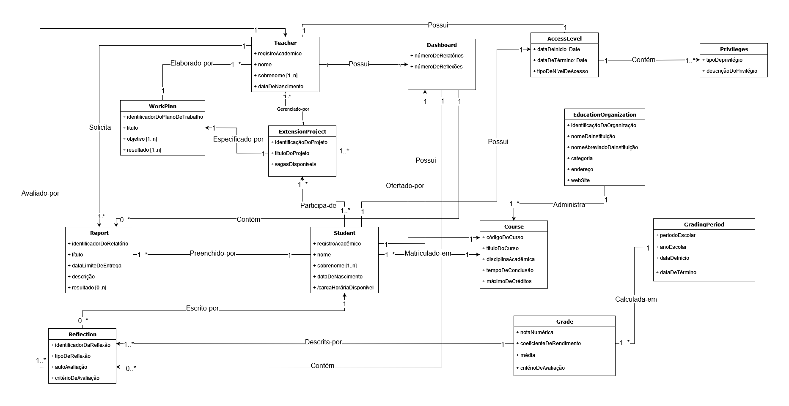

# Sysgext Domain Model

O seguinte modelo descreve o *Sysgext*. De forma breve, o Sysgext é uma plataforma de integração e unificação dos projetos de extensão para padronizar as solicitações e emissões de relatórios e reflexões desenvolvidos pelos estudantes durante a execução das atividades propostas.

  

